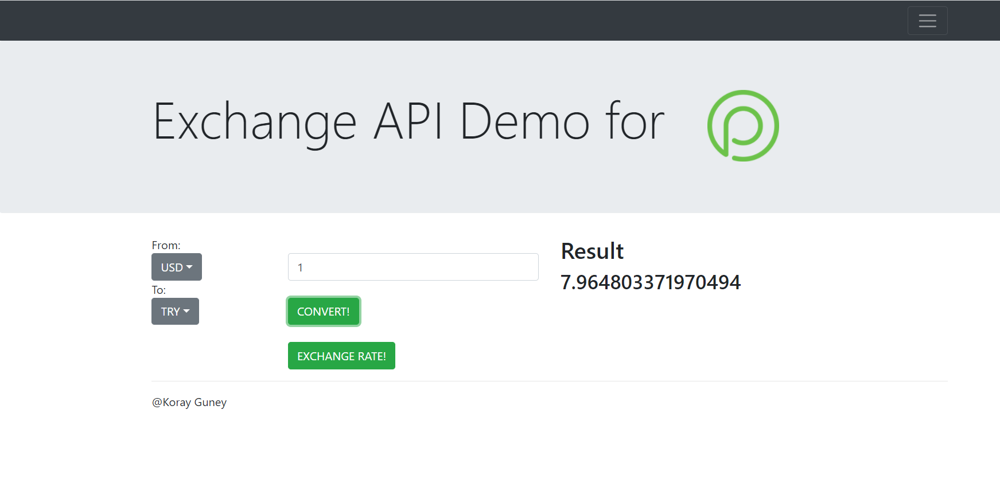
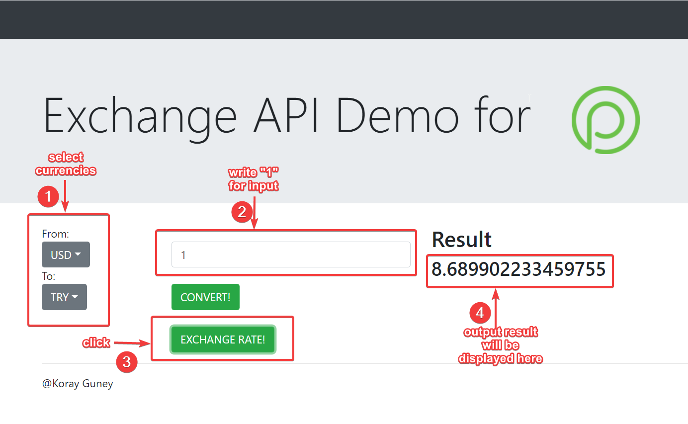
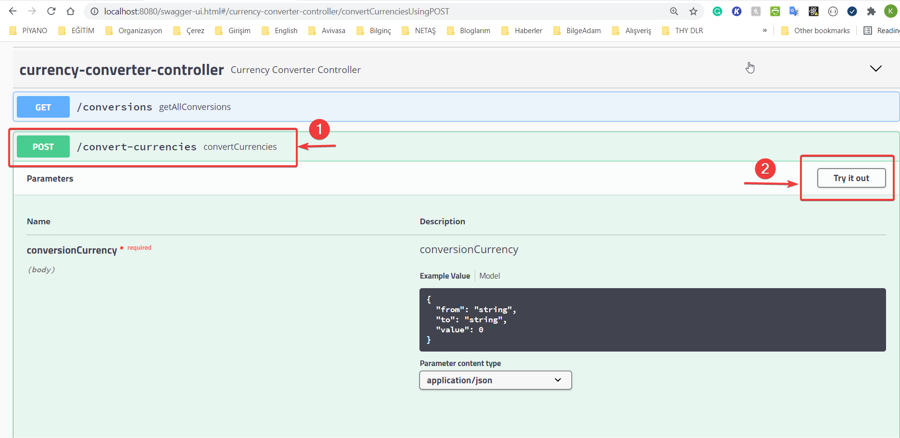
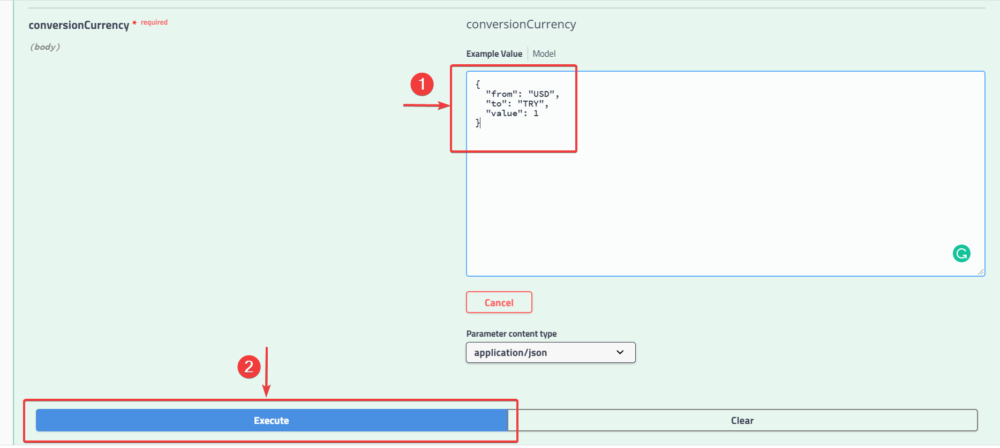
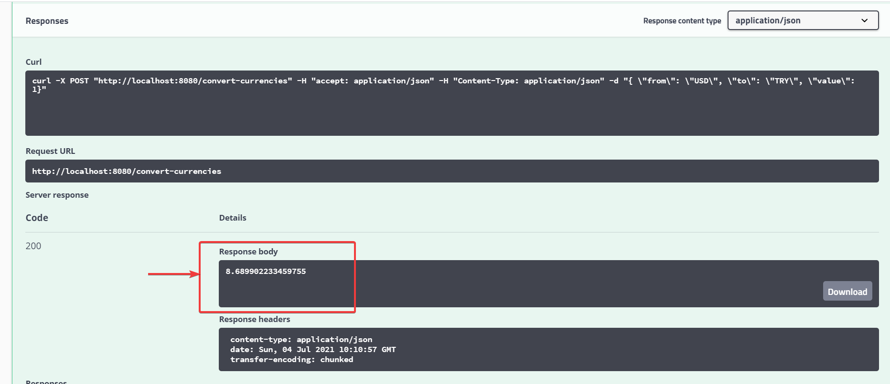
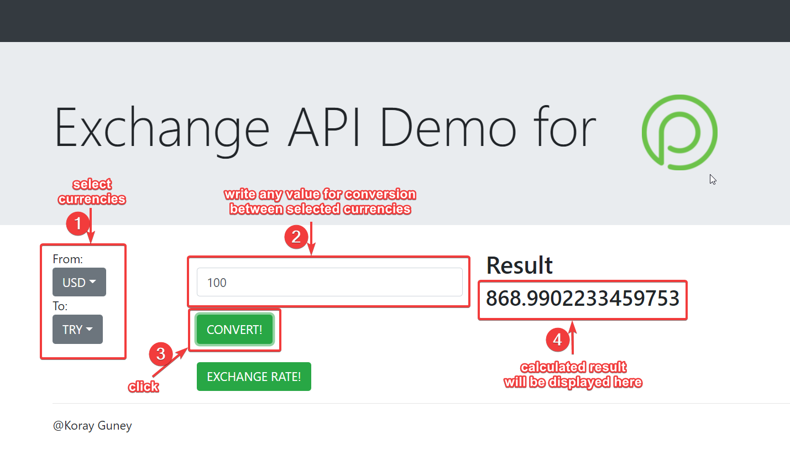
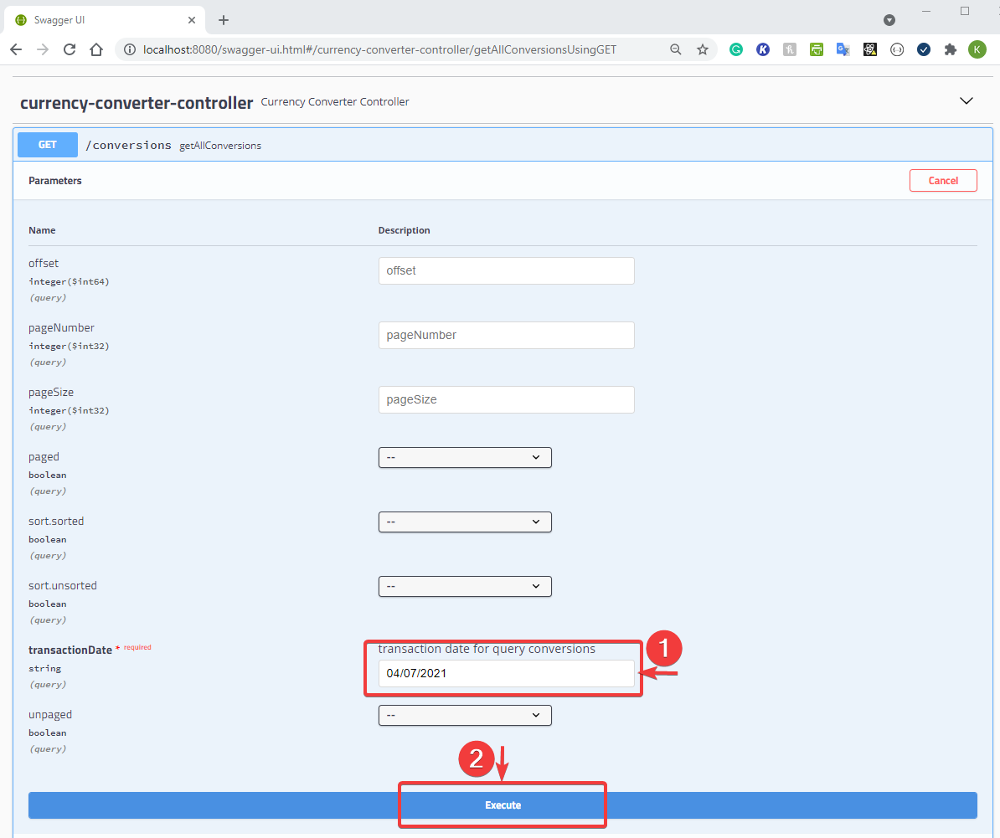
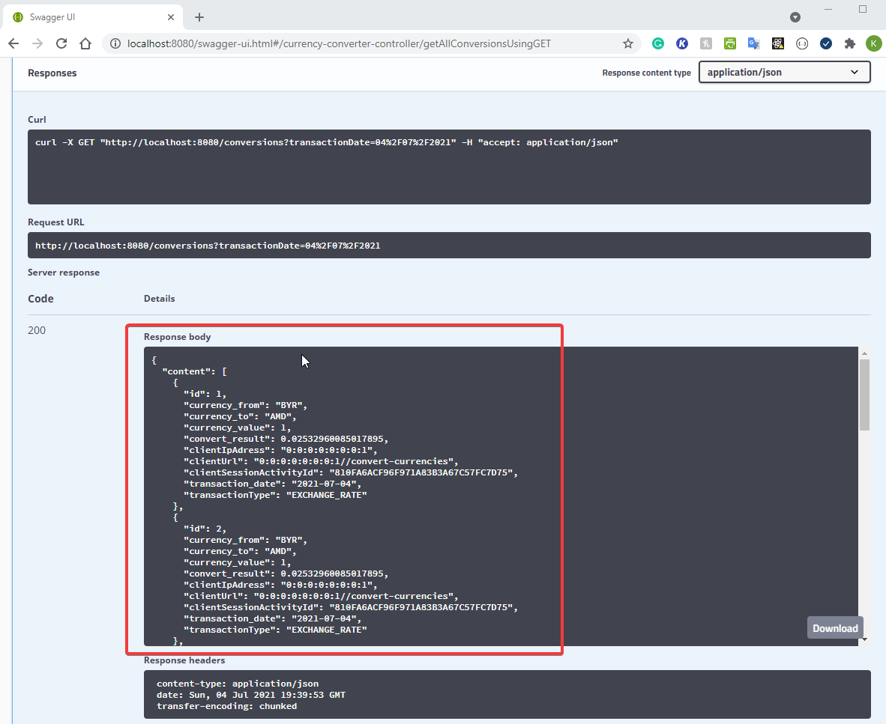
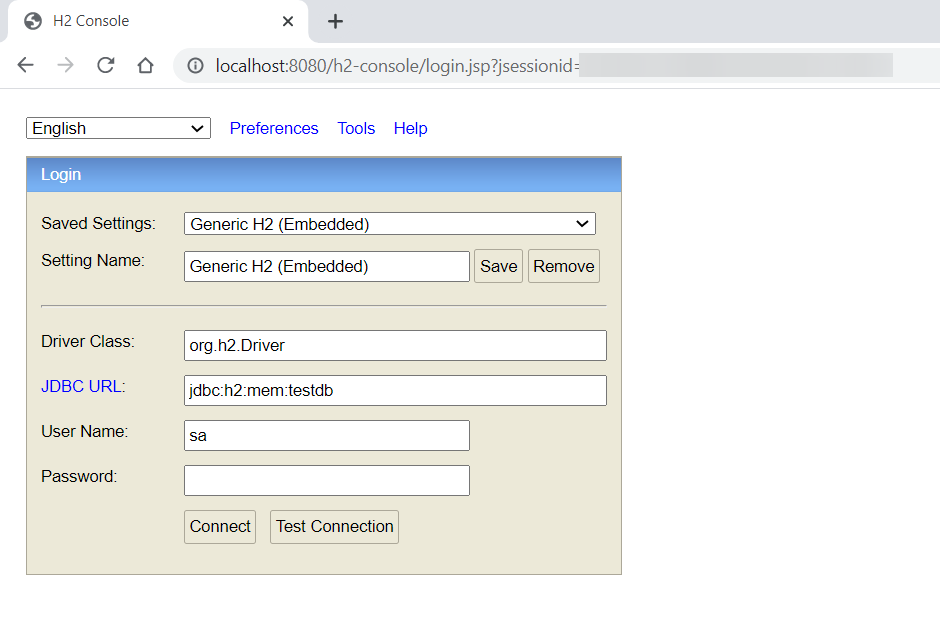

Demo Application for OpenPayd 
-----------------------------
This  application is prepared for the "**OpenPayd Company**" job task.  This application is a simple foreign exchange application which is one of the
most common services used in financial applications.

How to run the project:
-----------------------

On a separate terminal and since this is a maven project you just need to go to the root of the project and perform the command:
```
mvn clean install
```
or if you don't have installed maven on your OS

```
mvnw clan install
```


This will run the unit tests of the project and create the jar file.

After having the jar file you can simply run:

```
java -jar target/currency-converter-0.0.1-SNAPSHOT.jar
```

Since this is a Spring Boot project, you can also run the project with below command;
```
mvn spring-boot:run
```

or if you don't have installed maven on your OS
```
mvnw spring-boot:run
```

You can reach the index page by typing;

*  http://localhost:8080/

The project will run on port 8080 (configured as default).

Example screenshot;




How to test the project:
-----------------------

You can test the project from browser or it is also possible to test project with Swagger API UI.
According to OpenPayd task functional requirements;

### To test Exchange Rate API ; 
* from browser UI, select currencies from **'From:'** and **'To:'** dropdown boxes, write **'1'** to input section and 
  click **ExchangeRate** button;
  



* from the Swagger API, to access UI, go to;  http://localhost:8080/swagger-ui.html

Example screenshot;


To generate request;
1. Select **/convert-currencies** under **currency-converter-controller** and then **Try it out**
  

2. Prepare request body into JSON format (value must be '1') and press **Execute**;
  

3. To request a exchange rate from 'USD' to 'TRY', prepare a request body like;
```
{
  "from": "USD",
  "to": "TRY",
  "value": 1
}
```

4. Server response will be display;  
  

### To test Conversion API;

* from browser UI, select currencies from **'From:'** and **'To:'** dropdown boxes, write **'1'** to input section and
  click **ExchangeRate** button;



* from the Swagger API, to access UI, go to;  http://localhost:8080/swagger-ui.html and follow the similar steps written below 
  **['To test Exchange Rate API'](#to-test-exchange-rate-api-)** section.

### To test Conversion List API;

It is only available to test from Swagger API. 
1. Go to;  http://localhost:8080/swagger-ui.html
2. Select **/conversions** under **currency-converter-controller** and then **Try it out**
3. If you would like to get values by pages, fill in the necessary sections. 
4. All transactions could be queried by 'transaction date'. Write transaction date for querying conversions in **dd/MM/yyyy** 
   format and click **execute**;
   
5. Server response will be display;
   

### Database login

This project is using H2 database to store locally the url/deeplink conversion requests/responses. To access H2 console;
*  http://localhost:8080/h2-console/

After that, login screen will be displayed;



To login, below credentials must be written to login screen and then click **Connect**;

| Part  | Input |
| ------------- | ------------- |
| Driver Class  | org.h2.Driver |
| JDBC URL  | jdbc:h2:mem:testdb  |
| User Name | sa  |
| Password  | password  |

