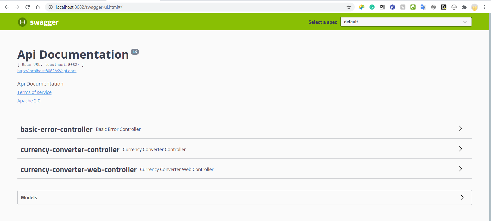

Demo Application for OpenPayd
-----------------------------
This foreign exchange application is prepared for the "**OpenPayd Company**" job task. 

How to run the project:
-----------------------

This project is using Redis to store locally the currencies convertion rates. So after installing Redis, you'll need to execute:

* **redis-server (_redis-server.exe for windows_)**

If you don't have Redis and your OS is windows, you can download Redis from the below link;

* https://github.com/microsoftarchive/redis/releases

On a separate terminal and since this is a maven project you just need to go to the root of the project and perform the command:

* _**mvn clean install**_

or
* **_mvnw clan install_** (if you don't have installed maven on your OS)

This will run the tests and create the jar file.

After having the jar file you can simply run:

* **_java -jar target/currency-converter-0.0.1-SNAPSHOT.jar_**

Since this is a Spring Boot project, you can also run the project with below command;
* **_mvn spring-boot:run_** 

or
* **_mvnw spring-boot:run_** (if you don't have installed maven on your OS)

You can reach the index page by typing;

*  http://localhost:8082/

The project will run on port 8082 (configured into application.yml).

Example screenshot;

How to test the project:
-----------------------

You can test the project from browser or it is also possible to test project with Swagger. 

To access the Swagger UI, just go to;
* http://localhost:8082/swagger-ui.html

Example screenshot;

